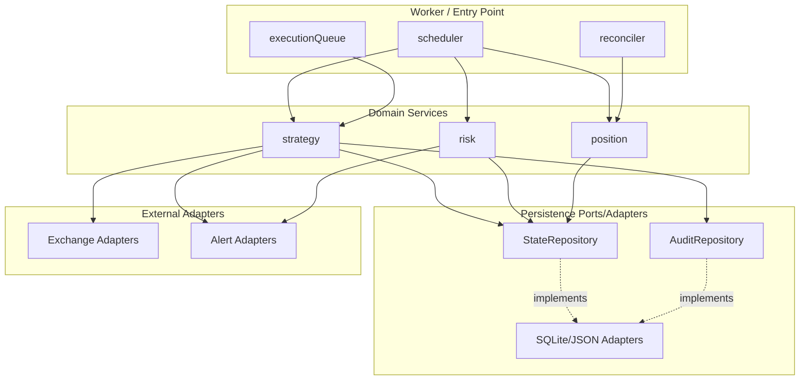

# ADR 0002: Pragmatic Hexagonal-Inspired Architecture

- **Status:** Accepted
- **Date:** 2026-02-04
- **Owners:** -
- **Related:**
  - [ADR-0001: Bot Architecture](0001-bot-architecture.md)
  - [ADR-0012: State Machines](0012-state-machines.md)
  - [ADR-0010: Exchange Adapters](0010-exchange-adapters.md)

## Context

The bot now encompasses multiple concerns:
- Market data ingestion (WebSocket + REST)
- Trading decision logic (strategy engine)
- Risk management (risk engine)
- Order execution and reconciliation
- Persistence (state snapshots, audit logs)

As the codebase grows, we need a structure that:
- Keeps business logic separate from infrastructure
- Preserves testability and portability for core workflows
- Allows swapping persistence or exchange adapters without rewriting core logic
- Avoids overengineering for a focused, single-purpose bot

We already use the adapter pattern for exchanges (ADR-0010). A full hexagonal architecture (ports/adapters for every dependency with heavy DI composition) adds complexity unlikely to pay off for this scope.

## Decision

We adopt a **pragmatic, hexagonal-inspired architecture**:

1. **Domain services live in `src/domains/`**
   - Business workflows are centralized in domain modules (strategy, risk, position).
   - Worker/entry points remain thin, focusing on scheduling and orchestration.

2. **Persistence keeps strict ports/adapters**
   - `src/lib/db/ports` defines interfaces.
   - `src/lib/db/adapters` provides implementations (SQLite/JSON today).
   - Domain services depend on ports, not adapters.

3. **External services use direct adapters**
   - Exchange adapters stay in `src/adapters/` (per ADR-0010).
   - Alert service adapters remain in `src/lib/alerts/`.
   - These are used directly by domain services to avoid unnecessary indirection.

### Directory Structure

```
src/
  worker/                   # Entry point, orchestration
    index.ts                # Main worker loop
    scheduler.ts            # Interval scheduling
    queue.ts                # Serial execution queue
  
  domains/                  # Domain services (business logic)
    strategy/
      strategy.ts           # Trading decision logic
      strategy.test.ts
      index.ts
    risk/
      risk.ts               # Risk evaluation
      risk.test.ts
      index.ts
    position/
      position.ts           # Position state derivation
      position.test.ts
      index.ts
  
  adapters/                 # Exchange adapters (per ADR-0010)
    types.ts
    binance/
    bybit/
    paper/
  
  lib/
    db/                     # Ports/adapters for persistence
      ports/
        state-repository.ts
        audit-repository.ts
        index.ts
      adapters/
        sqlite/
        json/
        index.ts
      index.ts
    alerts/                 # Alert service adapters
      discord.ts
      telegram.ts
      console.ts
      index.ts
    shared/                 # Utilities
      errors.ts
      schemas.ts
      logger.ts
```

### Dependency Direction

Strict dependency flow (no upward imports):

```
worker (entry point, orchestration)
  ↓
domains (business logic)
  ↓
lib/db/ports (persistence interfaces)
  ↓
adapters (exchange, db, alerts)
```

### Architecture Diagram



## Implementation Details

### Domain Services (Pure Business Logic)

Domain services are framework-agnostic and contain pure business logic:

```typescript
// src/domains/strategy/strategy.ts

/**
 * Evaluates market state and produces trading intent.
 * Pure business logic - no IO, no side effects.
 *
 * @see {@link ../../adrs/0002-hexagonal-inspired-architecture.md ADR-0002}
 */
export const evaluateStrategy = (
  state: MarketState,
  risk: RiskAssessment,
  config: StrategyConfig,
): TradingIntent => {
  // No position? Check for entry opportunity
  if (!state.position.open) {
    const opportunity = findOpportunity(state, config);
    if (opportunity && risk.level === "SAFE") {
      return { type: "ENTER_HEDGE", params: opportunity };
    }
    return { type: "NOOP" };
  }

  // Position open? Check exit conditions
  if (shouldExit(state, config)) {
    return { type: "EXIT_HEDGE", reason: "target_reached" };
  }

  return { type: "NOOP" };
};

// Pure helper - no IO
const findOpportunity = (
  state: MarketState,
  config: StrategyConfig,
): EntryOpportunity | null => {
  const spreadBps = calculateSpreadBps(state.funding, state.prices);
  if (spreadBps >= config.minSpreadBps) {
    return { spreadBps, size: calculateSize(state.account, config) };
  }
  return null;
};
```

### Persistence Ports (Interfaces)

```typescript
// src/lib/db/ports/state-repository.ts

export interface StateRepository {
  getLatestState(): Promise<PersistedState | null>;
  saveState(state: PersistedState): Promise<void>;
  getStateHistory(limit: number): Promise<PersistedState[]>;
}

export interface AuditRepository {
  logExecution(entry: ExecutionLog): Promise<void>;
  logDecision(entry: DecisionLog): Promise<void>;
  getExecutionHistory(since: Date): Promise<ExecutionLog[]>;
}
```

### Persistence Adapters (Implementations)

```typescript
// src/lib/db/adapters/sqlite/state-repository.ts

import type { StateRepository } from "../../ports";

export const createSqliteStateRepository = (
  db: Database,
): StateRepository => ({
  getLatestState: async () => {
    const row = await db.get("SELECT * FROM states ORDER BY timestamp DESC LIMIT 1");
    return row ? deserializeState(row) : null;
  },
  
  saveState: async (state) => {
    await db.run(
      "INSERT INTO states (timestamp, data) VALUES (?, ?)",
      [state.timestamp.toISOString(), JSON.stringify(state)],
    );
  },
  
  getStateHistory: async (limit) => {
    const rows = await db.all(
      "SELECT * FROM states ORDER BY timestamp DESC LIMIT ?",
      [limit],
    );
    return rows.map(deserializeState);
  },
});
```

### Worker Composition (Entry Point)

The worker composes adapters and domain services:

```typescript
// src/worker/index.ts

import { createBinanceAdapter } from "@/adapters/binance";
import { createSqliteStateRepository, createSqliteAuditRepository } from "@/lib/db/adapters/sqlite";
import { evaluateStrategy } from "@/domains/strategy";
import { evaluateRisk } from "@/domains/risk";
import { derivePosition } from "@/domains/position";

const start = async () => {
  // 1. Compose adapters
  const exchange = createBinanceAdapter(config.exchange);
  const stateRepo = createSqliteStateRepository(db);
  const auditRepo = createSqliteAuditRepository(db);
  
  // 2. Initialize state
  const persisted = await stateRepo.getLatestState();
  const truth = await exchange.getPositions();
  let state = mergeState(persisted, truth);
  
  // 3. Define evaluation tick (calls pure domain logic)
  const evaluate = () => {
    if (executionQueue.busy()) return;
    
    const risk = evaluateRisk(state, config.risk);
    const intent = evaluateStrategy(state, risk, config.strategy);
    
    if (intent.type !== "NOOP") {
      executionQueue.push(() => executeIntent(intent, exchange, auditRepo));
    }
  };
  
  // 4. Start loops
  schedule(evaluate, 2_000);
  schedule(() => reconcile(exchange, stateRepo), 60_000);
};
```

## When to Add Ports

Add a port/interface when:
- **Multiple implementations exist**: SQLite vs Postgres, Binance vs Bybit
- **Testing requires mocking**: Complex external dependencies
- **Swappability is expected**: Likely to change providers

Keep direct adapters when:
- **Single implementation forever**: Console logger, specific exchange
- **Simple enough to mock inline**: Alert services in tests
- **Indirection adds no value**: CLI output formatting

## Testing Strategy

| Layer | Testing Approach |
|-------|------------------|
| Domain services | Pure unit tests, no mocks needed |
| Persistence ports | Contract tests against adapters |
| Exchange adapters | Integration tests + paper adapter |
| Worker | End-to-end with paper adapter |

### Domain Testing (Pure)

```typescript
// src/domains/strategy/strategy.test.ts

describe("evaluateStrategy", () => {
  it("should return ENTER_HEDGE when spread exceeds threshold", () => {
    const state = createTestState({
      funding: { rateBps: 50n },
      position: { open: false },
    });
    const risk = { level: "SAFE" };
    const config = { minSpreadBps: 30n };

    const intent = evaluateStrategy(state, risk, config);

    expect(intent.type).toBe("ENTER_HEDGE");
  });

  it("should return NOOP when risk level is DANGER", () => {
    const state = createTestState({ funding: { rateBps: 50n } });
    const risk = { level: "DANGER" };

    const intent = evaluateStrategy(state, risk, defaultConfig);

    expect(intent.type).toBe("NOOP");
  });
});
```

## Consequences

### Positive

1. **Clear boundaries**: Worker handles orchestration; domain services handle business logic.
2. **Testability**: Domain services are pure functions, easily unit tested without mocks.
3. **Persistence flexibility**: Database adapter swaps remain isolated behind ports.
4. **Pragmatism**: Avoids the overhead of full hexagonal layering (no DI containers, no interface explosion).

### Negative

1. **Partial isolation**: Domain services still call some adapters directly (alerts, exchange).
2. **More files**: More folders and files than a flat structure.
3. **Convention-based**: Boundaries enforced by convention, not tooling.

### Mitigation

1. Keep domain services focused and small.
2. Promote adapters to ports only when real interchangeability is required.
3. Use path aliases and Biome lint rules to enforce dependency direction.

## References

- [ADR-0001: Bot Architecture](0001-bot-architecture.md) - Worker loop and execution model
- [ADR-0012: State Machines](0012-state-machines.md) - Order and hedge lifecycle states
- [ADR-0010: Exchange Adapters](0010-exchange-adapters.md) - Exchange adapter pattern
- [Alistair Cockburn - Hexagonal Architecture](https://alistair.cockburn.us/hexagonal-architecture/)
- [Clean Architecture by Robert C. Martin](https://blog.cleancoder.com/uncle-bob/2012/08/13/the-clean-architecture.html)
