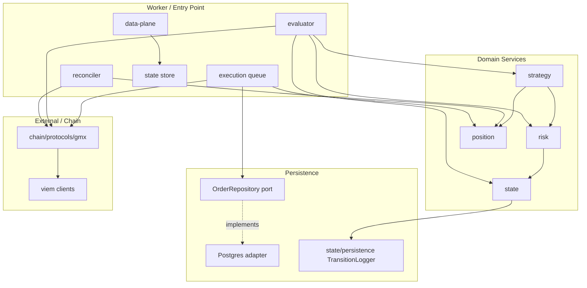

# ADR 0002: Pragmatic Hexagonal-Inspired Architecture

- **Status:** Accepted
- **Date:** 2026-02-04
- **Updated:** 2026-03-04
- **Owners:** -
- **Related:**
  - [ADR-0031: Bot Architecture (On-Chain)](0031-bot-architecture-on-chain.md)
  - [ADR-0012: State Machines](0012-state-machines.md)
  - [ADR-0010: Exchange Adapters](0010-exchange-adapters.md) (CEX; on-chain uses [ADR-0020](0020-contract-interaction-patterns.md))

## Context

The bot encompasses multiple concerns:
- **Data plane**: REST polling (GMX API) + RPC (contract reads); no WebSocket in the current on-chain architecture (ADR-0031).
- **Trading decision logic**: Strategy engine (entry/exit signals, trend analysis).
- **Risk management**: Risk engine (evaluate, emergency, position sizing).
- **Execution**: Transaction-based (build → simulate → send → confirm) via chain protocols (GMX adapter).
- **State and reconciliation**: In-memory state store, periodic reconciler with chain/REST.
- **Persistence**: Order repository (DB), state transition logging (audit trail).

As the codebase grows, we need a structure that:
- Keeps business logic separate from infrastructure
- Preserves testability and portability for core workflows
- Allows swapping persistence or chain adapters without rewriting core logic
- Avoids overengineering for a focused, single-purpose bot

We use the adapter pattern for the on-chain protocol (GMX in `lib/chain/protocols/gmx`) and for persistence (ports + Postgres adapter). A full hexagonal architecture (ports/adapters for every dependency with heavy DI composition) adds complexity unlikely to pay off for this scope.

## Decision

We adopt a **pragmatic, hexagonal-inspired architecture**:

1. **Domain services live in `src/domains/`**
   - Business workflows are centralized in domain modules: **strategy** (evaluate, entry-signal, exit-signal, trend-analysis), **risk** (evaluate, emergency, position-sizing), **position** (derive, metrics, reconcile), **state** (hedge-state, order-state, persistence).
   - Worker/entry points remain thin, focusing on scheduling and orchestration.

2. **Persistence keeps strict ports/adapters**
   - `src/lib/db/ports` defines interfaces (e.g. `OrderRepository`).
   - `src/lib/db/adapters/postgres` provides the implementation.
   - Domain/worker code depends on ports, not concrete adapters. State transition audit is in `domains/state/persistence` (TransitionLogger; MVP in-memory, DB optional later).

3. **On-chain and external services use adapters in `lib/`**
   - Chain and protocol access live in `src/lib/chain/` (client, tx-builder, tx-sender, gas, health). The GMX protocol adapter is in `src/lib/chain/protocols/gmx/` (adapter, api, utils, schema). No CEX exchange adapters in the current codebase (ADR-0031).
   - Optional alert adapters would live in `src/lib/alerts/` if added; domains depend on such adapters directly to avoid unnecessary indirection.

### Directory Structure

```
src/
  worker/                       # Orchestration and entry
    start-worker.ts             # Composes data plane, evaluator, reconciler, queue
    state.ts                    # In-memory state store
    queue/index.ts              # Serial execution queue
    scheduler/                  # Evaluation interval scheduling
    data-plane/                # REST + RPC polling orchestration
    data-collector/             # Data collection
    evaluator/                 # Health, startup, evaluate tick
    execution/                 # enter-hedge, exit-hedge, fill-confirmation, slippage, drift
    reconciler/                # Reconcile with chain/REST
    websocket/                 # (Optional) WS health/message handling
    freshness.ts               # Staleness checks
    impact-sampler/            # Execution impact sampling
    impact-analysis/           # Impact analysis

  domains/                      # Domain services (business logic)
    strategy/
      evaluate/                # evaluateStrategy
      entry-signal/            # generateEntrySignal
      exit-signal/             # generateExitSignal
      trend-analysis/          # analyzeFundingRateTrend
      index.ts
    risk/
      evaluate/                # evaluateRisk
      emergency/               # checkEmergencyConditions, kill switch
      position-sizing/         # calculateMaxPositionSizeQuote
      index.ts
    position/
      derive/                  # derivePosition
      metrics/                 # margin, notional, PnL helpers
      reconcile/               # reconcilePosition
      index.ts
    state/
      hedge-state/             # Hedge state machine
      order-state/             # Order state machine
      persistence/             # TransitionLogger (audit)
      index.ts

  lib/
    chain/                     # On-chain client and execution
      client/                  # viem public/wallet clients
      protocols/gmx/           # GMX adapter, API, utils, schema
      tx-builder/              # Transaction construction
      tx-sender/               # Send and confirm
      gas/                     # Gas estimation
      health/                  # RPC/chain health
      errors/
    db/
      ports/                   # OrderRepository interface
      adapters/postgres/       # OrderRepository implementation
      schema.ts
    env/                       # Env validation
    logger/                    # Structured logger
    rate-limiter/              # Backoff, circuit-breaker, request-policy
    protocols/                 # Shared protocol guards/config
    config.ts
  server/                      # HTTP server (health, metrics routes)
    index/
    routes/health/
    routes/metrics/
```

### Dependency Direction

Strict dependency flow (no upward imports):

```
worker (start-worker, data-plane, evaluator, execution, reconciler, queue)
  ↓
domains (strategy, risk, position, state)
  ↓
lib/db/ports (OrderRepository), lib/chain (protocols/gmx), lib/logger, lib/env
  ↓
lib/db/adapters/postgres, lib/chain/protocols/gmx implementation
```

### Architecture Diagram


```mermaid
flowchart TB
    subgraph worker [Worker / Entry Point]
        W1[data-plane]
        W2[evaluator]
        W3[execution queue]
        W4[reconciler]
        W5[state store]
    end

    subgraph domains [Domain Services]
        D1[strategy]
        D2[risk]
        D3[position]
        D4[state]
    end

    subgraph persistence [Persistence]
        P1[OrderRepository port]
        A1[Postgres adapter]
        D4P[state/persistence TransitionLogger]
    end

    subgraph external [External / Chain]
        E1[chain/protocols/gmx]
        E2[viem clients]
    end

    W1 --> W5
    W2 --> D1
    W2 --> D2
    W3 --> D3
    W4 --> D3
    W2 --> D4

    D1 --> D2
    D1 --> D3
    D2 --> D4
    D4 --> D4P

    P1 -.->|implements| A1
    W3 --> P1
    W4 --> E1
    W2 --> E1
    W3 --> E1
    E1 --> E2
```

## Implementation Details

### Domain Services (Pure Business Logic)

Domain services are framework-agnostic and contain pure business logic.

**Strategy evaluation** (`domains/strategy/evaluate/`) is a pure function: it takes market state (e.g. `StrategyInput`), risk assessment, and config; returns a discriminated union `TradingIntent` (`ENTER_HEDGE` | `EXIT_HEDGE` | `NOOP`); and delegates to `evaluateRisk`, `analyzeFundingRateTrend`, `generateEntrySignal`, `generateExitSignal`, and `calculateMaxPositionSizeQuote`. No I/O, no side effects — all dependencies passed as arguments. See the source for the current implementation.

### Persistence Ports (Interfaces)

Persistence is defined by ports; the current codebase uses `OrderRepository` for order/tx records. State transition audit is handled by `domains/state/persistence` (TransitionLogger):

```typescript
// src/lib/db/ports/order-repository.ts

export interface OrderRepository {
  create(order: CreateOrderInput): Promise<Order>;
  findById(id: string): Promise<Order | null>;
  findByExchangeOrderId(exchange: string, exchangeOrderId: string): Promise<Order | null>;
  findByTxHash(txHash: string): Promise<Order | null>;
  update(id: string, updates: Partial<Order>): Promise<Order>;
  list(filters: OrderFilters): Promise<Order[]>;
}
```

### Persistence Adapters (Implementations)

Implementations live under `lib/db/adapters/postgres`. The current adapter implements `OrderRepository` with Drizzle (create, findById, findByExchangeOrderId, findByTxHash, update, list). Domain and worker code depend only on the port; see `createPostgresOrderRepository` in source for the current implementation.

### Worker Composition (Entry Point)

The worker is composed in `start-worker.ts`: it creates chain clients (public + wallet), the GMX adapter, in-memory state store, and serial execution queue; runs a startup sequence (e.g. reconcile with chain); starts the data plane for REST + RPC polling; and schedules an evaluation tick that reads a snapshot, runs `evaluateRisk` and `evaluateStrategy`, and enqueues `executeEnterHedge` or `executeExitHedge` when intent is not `NOOP`. A separate schedule runs the reconciler periodically. See the source for current orchestration (evaluator, data collector, impact sampler, health monitor).

## When to Add Ports

Add a port/interface when:
- **Multiple implementations exist or are planned**: e.g. OrderRepository (Postgres); chain protocol adapter (GMX today, potential other protocols later).
- **Testing requires mocking**: Complex external dependencies (DB, RPC, REST).
- **Swappability is expected**: Likely to change providers (DB, chain RPC).

Keep direct adapters when:
- **Single implementation and no swap planned**: e.g. logger, env loader.
- **Simple enough to mock inline**: Small utilities in tests.
- **Indirection adds no value**: Pure helpers with no I/O.

## Testing Strategy

| Layer | Testing Approach |
|-------|------------------|
| Domain services | Pure unit tests, no mocks (e.g. `strategy/evaluate/evaluate.test.ts`, `risk/evaluate/evaluate.test.ts`) |
| Persistence ports | Contract tests against Postgres adapter |
| Chain/protocol adapter | Unit tests with mocked viem clients; integration tests on testnet where needed |
| Worker | Integration tests with mocked adapter and queue |

## Consequences

### Positive

1. **Clear boundaries**: Worker handles orchestration; domain services handle business logic.
2. **Testability**: Domain services are pure functions, easily unit tested without mocks.
3. **Persistence flexibility**: Database adapter swaps remain isolated behind ports.
4. **Pragmatism**: Avoids the overhead of full hexagonal layering (no DI containers, no interface explosion).

### Negative

1. **Partial isolation**: Domain services and worker still use some adapters directly (e.g. chain/protocol, logger).
2. **More files**: More folders and files than a flat structure.
3. **Convention-based**: Boundaries enforced by convention, not tooling.

### Mitigation

1. Keep domain services focused and small.
2. Promote adapters to ports only when real interchangeability is required.
3. Use path aliases and Biome lint rules to enforce dependency direction.

## References

- [ADR-0031: Bot Architecture (On-Chain)](0031-bot-architecture-on-chain.md) — Worker loop, data plane, execution model
- [ADR-0012: State Machines](0012-state-machines.md) — Order and hedge lifecycle states
- [ADR-0020: Contract Interaction Patterns](0020-contract-interaction-patterns.md) — Build/simulate/send/confirm
- [ADR-0010: Exchange Adapters](0010-exchange-adapters.md) — CEX adapter pattern (historical)
- [Alistair Cockburn - Hexagonal Architecture](https://alistair.cockburn.us/hexagonal-architecture/)
- [Clean Architecture by Robert C. Martin](https://blog.cleancoder.com/uncle-bob/2012/08/13/the-clean-architecture.html)
