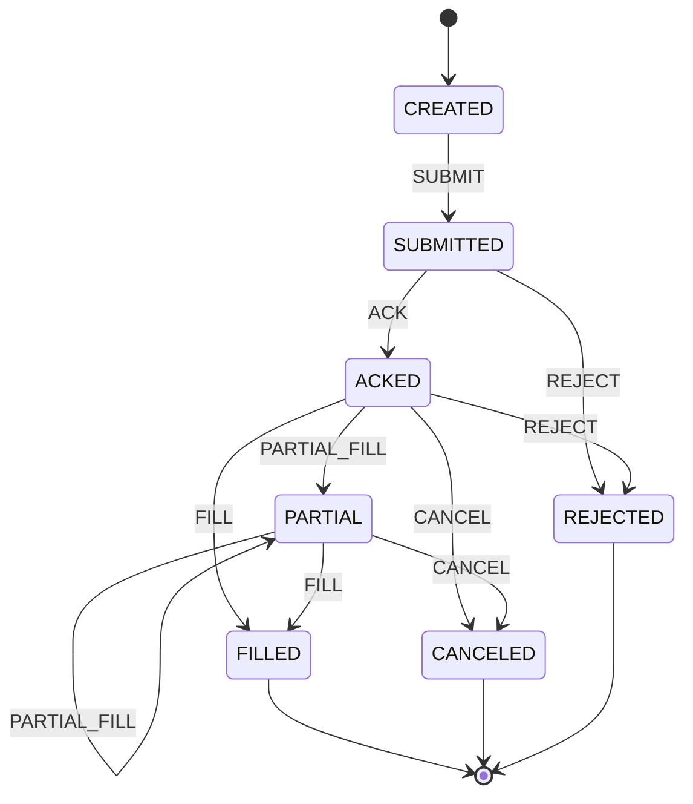
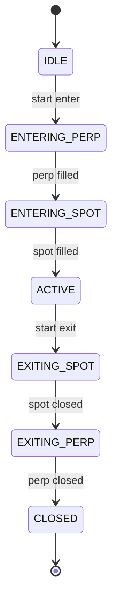

# ADR 0012: State Machines for Order and Position Lifecycle

- **Status:** Superseded
- **Date:** 2026-02-04
- **Updated:** 2026-03-04
- **Owners:** -
- **Superseded by:** [ADR-0032: State Machines (On-Chain)](0032-state-machines-on-chain.md)
- **Related:**
  - [ADR-0001: Bot Architecture](0001-bot-architecture.md)
  - [ADR-0010: Exchange Adapters](0010-exchange-adapters.md)

> **Superseded.** The bot now uses an on-chain exchange. For state machines in the current system (transaction lifecycle; position derived from chain), see [ADR-0032: State Machines (On-Chain)](0032-state-machines-on-chain.md). This document retains **CEX order and hedge state definitions** and diagrams for historical reference.

## Context

The bot manages multi-step flows that need:
- Clear valid state transitions
- Invalid transitions caught at compile time or runtime
- State history for debugging and audit
- Idempotency for retries

On CEX, order lifecycle (CREATED → SUBMITTED → ACKED → FILLED etc.) and hedge lifecycle (IDLE → ENTERING → ACTIVE → EXITING → CLOSED) were explicit state machines. On-chain (ADR-0032), the primitive is **transaction lifecycle**; position is derived from chain.

## Decision

Use explicit state machines with discriminated union types, explicit transition tables, and validation. **For the current (on-chain) system, see ADR-0032.** Below are the CEX state definitions and diagrams for reference.

## CEX Order Lifecycle (Historical)

### States

| State     | Meaning                    | Terminal |
|----------|----------------------------|----------|
| CREATED  | Order built, not yet sent   | No       |
| SUBMITTED| Sent to exchange, no ACK   | No       |
| ACKED    | Exchange acknowledged      | No       |
| PARTIAL  | Partially filled           | No       |
| FILLED   | Fully filled               | Yes      |
| CANCELED | Canceled                   | Yes      |
| REJECTED | Rejected by exchange       | Yes      |

### Valid Transitions

- CREATED → SUBMITTED
- SUBMITTED → ACKED | REJECTED
- ACKED → PARTIAL | FILLED | CANCELED | REJECTED
- PARTIAL → PARTIAL | FILLED | CANCELED
- FILLED, CANCELED, REJECTED → (none)

### Order Lifecycle Diagram

## CEX Hedge Lifecycle (Historical)

### States

| Phase          | Meaning                                      |
|----------------|----------------------------------------------|
| IDLE           | No position, not entering or exiting         |
| ENTERING_PERP  | Perp order in flight (intentId, symbol)      |
| ENTERING_SPOT  | Spot leg in flight (perpFilled, symbol)      |
| ACTIVE         | Position open (symbol, notional, quantities) |
| EXITING_SPOT   | Closing spot leg (symbol)                    |
| EXITING_PERP   | Closing perp leg (symbol)                    |
| CLOSED         | Flat (symbol, pnlQuote)                      |

### Hedge Lifecycle Diagram

## Patterns (Still Relevant)

- **Discriminated union types** for states (compile-time exhaustiveness).
- **Explicit transition table**: only listed transitions are valid; validation at runtime.
- **Intent IDs** for idempotency (same intent ID on retry avoids double execution).
- **State persistence** for audit: entityType, entityId, fromState, toState, event, correlationId, timestamp.
- **Timeout handling**: SUBMITTED can timeout to REJECTED/TIMEOUT; ACKED/PARTIAL can timeout for fill. See ADR-0032 for on-chain timeout (e.g. TX PENDING → TIMED_OUT).

Implementation details (transition functions, event types, fill confirmation polling) are in source; on-chain equivalents in ADR-0032.

## Consequences

### Positive
- Valid transitions documented and enforced
- Invalid transitions caught early
- State history trackable for debugging
- Idempotency prevents duplicate actions

### Negative
- More boilerplate than ad-hoc state management
- Transition tables must be updated when adding states

## References

- [ADR-0032: State Machines (On-Chain)](0032-state-machines-on-chain.md) — Current transaction lifecycle and position model
- [ADR-0001: Bot Architecture](0001-bot-architecture.md)
- [ADR-0010: Exchange Adapters](0010-exchange-adapters.md)
